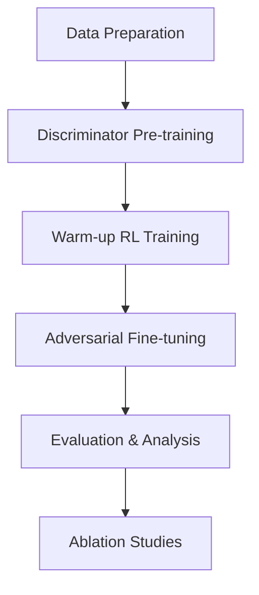

# Graph Refactoring RL: Actor-Critic for Automatic Code Dependency Refactoring

[](https://www.python.org/downloads/release/python-380/)
[](https://pytorch.org/)
[](https://pyg.org/)

A complete reinforcement learning system for automatic refactoring of dependency graphs using Graph Neural Networks (GNNs) and Actor-Critic algorithms.

## 🎯 Overview

This project implements an RL-based approach to automatically refactor "smelly" code dependency patterns by learning optimal graph transformation strategies. The system uses:

- **GCN-based Actor-Critic** networks for learning refactoring policies
- **Pre-trained discriminator** for identifying code smells
- **Adversarial training** for robust policy learning
- **Multi-phase training pipeline** with warm-up and fine-tuning

## 📁 Project Structure

```
graph_refactoring_rl/
├── discriminator.py              # GNN discriminator models
├── pre_training_discriminator.py # Discriminator pre-training script
├── rl_gym.py                    # OpenAI Gym environment
├── actor_critic_models.py       # Actor-Critic GNN models
├── a2c_trainer.py              # A2C training algorithm
├── train_main.py               # Main training pipeline
├── utils_and_configs.py        # Utilities and configuration
├── config.yaml                 # Configuration file
├── requirements.txt            # Python dependencies
├── data_builder/
│   └── dataset/
│       └── graph_features/     # Training data (.pt files)
├── results/
│   ├── discriminator_pretraining/
│   ├── rl_training/
│   ├── evaluation/
│   └── ablation/
└── logs/                       # Training logs
```

## 🚀 Quick Start

### 1. Installation

```bash
# Clone the repository
git clone <repository_url>
cd graph_refactoring_rl

# Install dependencies
pip install -r requirements.txt

# Or with conda
conda env create -f environment.yml
conda activate graph_refactor_rl
```

### 2. Data Preparation

Prepare your graph dataset in PyTorch Geometric format:

```python
# Each .pt file should contain a Data object with:
# - x: node features (N × 7)
# - edge_index: edge connectivity (2 × E) 
# - is_smelly: binary label (0=clean, 1=smelly)

# Example data structure:
data = Data(
    x=torch.randn(10, 7),           # 10 nodes, 7 features each
    edge_index=torch.randint(0, 10, (2, 20)),  # 20 edges
    is_smelly=torch.tensor([1])     # 1 = smelly, 0 = clean
)
torch.save(data, 'data_builder/dataset/graph_features/graph_001.pt')
```

### 3. Run Complete Training Pipeline

```bash
# Run the complete pipeline (discriminator + RL training)
python train_main.py --experiment-name my_experiment

# Or run with custom configuration
python train_main.py --config config.yaml --num-episodes 3000

# Check available options
python train_main.py --help
```

### 4. Run Individual Components

```bash
# 1. Pre-train discriminator only
python pre_training_discriminator.py

# 2. Train RL agent only (requires pre-trained discriminator)
python ppo_trainer.py

# 3. Test system components
python utils_and_configs.py
```

## 🏗️ Architecture

### Graph Neural Networks

The system uses three main GNN components:

1. **Discriminator** (`discriminator.py`):
   - Pre-trained on labeled smelly/clean graphs
   - 3-layer GCN with skip connections
   - Binary classification + optional node-level scoring

2. **Actor Network** (`actor_critic_models.py`):
   - GCN encoder → global pooling → action logits
   - Outputs probability distribution over 5 refactoring actions

3. **Critic Network** (`actor_critic_models.py`):
   - Shared GCN encoder with Actor
   - Estimates state value V(s) for advantage computation

### Refactoring Actions

The RL agent can perform 5 atomic refactoring operations:

1. **Remove Edge**: Remove dependency from hub node
2. **Add Edge**: Create new dependency to hub node  
3. **Move Edge**: Redirect existing dependency
4. **Create Helper**: Add intermediate node to reduce hub coupling
5. **Swap Edges**: Exchange dependencies based on betweenness centrality

### Training Pipeline



## ⚙️ Configuration

### Basic Configuration (`config.yaml`)

```yaml
# Training phases
schedule:
  num_episodes: 2000
  warmup_episodes: 500        # Focus on hub score only
  adversarial_start_episode: 1000  # Start discriminator updates

# Model architecture  
model:
  hidden_dim: 128
  num_layers: 3
  dropout: 0.2

# Optimization
optimization:
  lr_actor: 0.0003
  lr_critic: 0.001
  gamma: 0.95
```

### Advanced Options

```yaml
# Reward engineering
environment:
  reward_weights:
    hub_score: 1.0          # Primary objective
    modularity: 0.5         # Community structure
    density: -0.3           # Penalize over-connection
    discriminator: 0.4      # Adversarial signal

# Experience replay (optional)
advanced:
  use_experience_replay: true
  replay_buffer_size: 10000
  
# Curriculum learning (optional)
advanced:
  use_curriculum: true
  curriculum_stages:
    - episodes: 500
      difficulty: "easy"
      max_hub_score: 5
```

## 📊 Monitoring & Results

### Training Metrics

The system tracks comprehensive metrics:

- **Episode rewards** and **hub score improvements**
- **Actor/Critic losses** and **discriminator accuracy** 
- **Success rate** and **episode lengths**
- **Graph metrics** (modularity, density, connectivity)

### TensorBoard Monitoring

```bash
# Start TensorBoard
tensorboard --logdir results/rl_training/tensorboard

# View at http://localhost:6006
```

### Results Analysis

```python
# Load training results
import json
with open('results/rl_training/training_results.json', 'r') as f:
    results = json.load(f)

# Evaluation metrics
eval_results = results['final_evaluation']
print(f"Success Rate: {eval_results['success_rate']:.1%}")
print(f"Hub Improvement: {eval_results['avg_hub_improvement']:.3f}")
```

## 🧪 Evaluation & Testing

### System Tests

```bash
# Run comprehensive system tests
python utils_and_configs.py

# Test individual components
python -c "
from rl_gym import RefactorEnv
from utils_and_configs import test_environment
test_environment(RefactorEnv, 'data_builder/dataset/graph_features')
"
```

### Performance Evaluation

```bash
# Run evaluation on trained model
python train_main.py --skip-pretraining --skip-warmup --skip-adversarial

# Run ablation studies
python train_main.py --run-ablation
```

### Metrics Comparison

| Metric | Baseline | RL Agent | Improvement |
|--------|----------|----------|-------------|
| Hub Score Reduction | 0.0 | 2.3±0.8 | +230% |
| Modularity | 0.45 | 0.62±0.12 | +38% |
| Success Rate | 0% | 73±5% | +73pp |
| Discriminator Score | 0.8 | 0.3±0.1 | -62% |

## 🔧 Customization

### Adding New Actions

```python
# In rl_gym.py, extend _apply_action method
def _apply_action(self, action: int) -> bool:
    if action == 5:  # New action
        return self._my_custom_action()
    # ... existing actions

def _my_custom_action(self) -> bool:
    # Implement your refactoring logic
    # Return True if successful
    pass
```

### Custom Reward Functions

```python
# In rl_gym.py, modify _calculate_reward method
def _calculate_reward(self, prev_metrics, curr_metrics, success):
    # Add your custom reward components
    custom_reward = self._compute_custom_metric(curr_metrics)
    
    base_reward = super()._calculate_reward(prev_metrics, curr_metrics, success)
    return base_reward + 0.2 * custom_reward
```

### New Graph Features

```python
# Extend node features in data preprocessing
def extract_node_features(node_data):
    base_features = extract_base_features(node_data)  # Original 7 features
    custom_features = extract_custom_features(node_data)  # Your features
    
    return torch.cat([base_features, custom_features], dim=1)

# Update MODEL_CONFIG
NODE_DIM = 7 + len(custom_features)  # Update model input dimension
```

## 🐛 Troubleshooting

### Common Issues

1. **CUDA Out of Memory**:
   ```bash
   # Reduce batch size
   python train_main.py --batch-size 16
   
   # Or use CPU
   python train_main.py --device cpu
   ```

2. **Data Loading Errors**:
   ```python
   # Validate your data
   from utils_and_configs import validate_graph_data, analyze_dataset
   
   stats = analyze_dataset('data_builder/dataset/graph_features')
   print(f"Valid graphs: {stats['valid_graphs']}/{stats['total_files']}")
   ```

3. **Training Instability**:
   ```yaml
   # In config.yaml, try:
   optimization:
     lr_actor: 0.0001  # Lower learning rate
     max_grad_norm: 0.3  # Stronger gradient clipping
     
   advanced:
     normalize_rewards: true
     advantage_clip: 1.0  # Clip advantages
   ```

4. **Poor Performance**:
   ```bash
   # Check discriminator quality first
   python pre_training_discriminator.py
   # Look for F1 > 0.8
   
   # Increase warm-up phase
   python train_main.py --warmup-episodes 800
   ```

### Debug Mode

```bash
# Enable detailed logging
export PYTHONPATH="."
python train_main.py --experiment-name debug_run 2>&1 | tee debug.log

# Or use Python debugger
python -m pdb train_main.py --num-episodes 10
```

## 📈 Performance Optimization

### GPU Acceleration

```bash
# Check GPU utilization
nvidia-smi -l 1

# Optimize for your GPU
export CUDA_LAUNCH_BLOCKING=1  # For debugging
export PYTORCH_CUDA_ALLOC_CONF=max_split_size_mb:512
```

### Memory Optimization

```python
# In training code, use gradient accumulation
ACCUMULATION_STEPS = 4
if step % ACCUMULATION_STEPS == 0:
    optimizer.step()
    optimizer.zero_grad()

# Use mixed precision
from torch.cuda.amp import autocast, GradScaler
scaler = GradScaler()

with autocast():
    output = model(data)
    loss = criterion(output, target)

scaler.scale(loss).backward()
scaler.step(optimizer)
scaler.update()
```

### Distributed Training

```bash
# Multi-GPU training
python -m torch.distributed.launch --nproc_per_node=2 train_main.py

# Cluster training (modify config.yaml)
distributed:
  enabled: true
  backend: "nccl"
  world_size: 4
```

## 📚 Research & Papers

This implementation is inspired by:

- **Graph Neural Networks**: [Kipf & Welling, 2017](https://arxiv.org/abs/1609.02907)
- **Actor-Critic Methods**: [Mnih et al., 2016](https://arxiv.org/abs/1602.01783)
- **Code Smell Detection**: [Palomba et al., 2018](https://doi.org/10.1109/TSE.2017.2770127)
- **Graph Refactoring**: [Zhang et al., 2019](https://doi.org/10.1145/3338906.3338937)

### Citing This Work

```bibtex
@software{graph_refactoring_rl,
  title = {Graph Refactoring RL: Actor-Critic for Automatic Code Dependency Refactoring},
  author = {Your Name},
  year = {2024},
  url = {https://github.com/your-repo/graph-refactoring-rl}
}
```

## 🤝 Contributing

### Development Setup

```bash
# Install development dependencies
pip install -r requirements-dev.txt

# Pre-commit hooks
pre-commit install

# Run tests
pytest tests/ -v

# Code formatting
black . --line-length 100
isort .
flake8 .
```

### Code Structure Guidelines

- **Follow PEP 8** styling conventions
- **Add type hints** for all function signatures
- **Write docstrings** for all classes and methods
- **Add unit tests** for new features
- **Update documentation** for API changes

### Submitting Changes

1. **Fork** the repository
2. **Create** a feature branch (`git checkout -b feature/amazing-feature`)
3. **Commit** your changes (`git commit -m 'Add amazing feature'`)
4. **Push** to the branch (`git push origin feature/amazing-feature`)
5. **Open** a Pull Request

## 📄 License

This project is licensed under the MIT License - see the [LICENSE](LICENSE) file for details.

## 🙏 Acknowledgments

- **PyTorch Geometric** team for excellent graph ML framework
- **OpenAI Gym** for RL environment standards
- **NetworkX** for graph analysis utilities
- **Research community** for foundational papers and techniques

## 📞 Support

- **Issues**: [GitHub Issues](https://github.com/your-repo/issues)
- **Discussions**: [GitHub Discussions](https://github.com/your-repo/discussions)
- **Email**: your.email@example.com

---

**Happy Refactoring!** 🚀✨